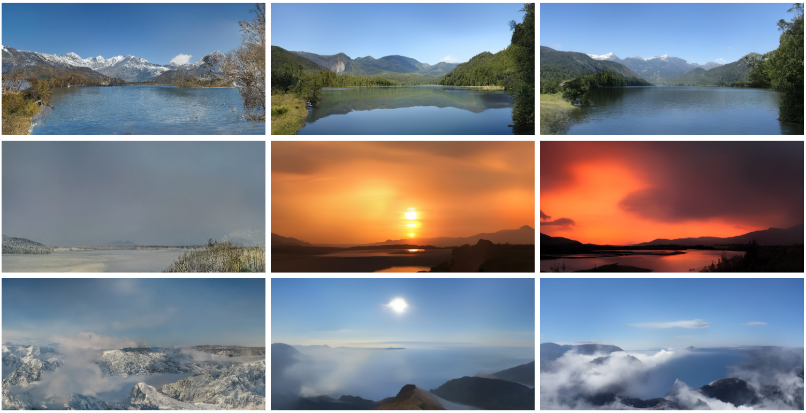

## TorchDiff
#### A Python Diffusion Library Built on PyTorch

[](https://opensource.org/licenses/MIT)
[](https://pytorch.org/)

  
*Source: [High-Resolution Image Synthesis with Latent Diffusion Models](https://arxiv.org/abs/2112.10752)*

### Overview

TorchDiff is a PyTorch-based library for building diffusion models, inspired by original research papers. The first release, **TorchDiff 1.0.0**, includes four model families: **DDPM**, **DDIM**, **SDE**, and **LDM**. These models support both **conditional** (e.g., text-prompt-based) and **unconditional** generation.

Each model is organized into modular components:
- **Forward Diffusion**: Adds noise to images (e.g., `ForwardDDPM` for DDPM).
- **Reverse Diffusion**: Removes noise to generate images (e.g., `ReverseDDPM`).
- **Hyperparameters**: Manages noise schedules and related settings (e.g., `HyperParamsDDPM`).
- **Training**: Handles model training (e.g., `TrainDDPM`).
- **Sampling**: Generates images during inference (e.g., `SampleDDPM`).

Additional utilities include:
- **Noise Predictor**: A U-Net-like neural network with time embedding and attention to denoise images (`NoisePredictor`).
- **Text Encoder**: A transformer-based model (e.g., BERT) for text-conditioned generation (`TextEncoder`).
- **Metrics**: Evaluates image quality with metrics like MSE, PSNR, SSIM, FID, and LPIPS (`Metrics`).

---

### Installation

TorchDiff is available on PyPI and can be installed using pip. Alternatively, you can clone the repository for development purposes. The library depends on the packages listed in `requirements.txt`, which are automatically installed when using pip.

#### Install via PyPI (Recommended)
```bash
pip install -r requirements.txt
pip install torchdiff
````
#### Install via Repository (Optional)
```bash
# Clone the repository
git clone https://github.com/LoqmanSamani/DiffusionModels.git
cd DiffusionModels

# Install dependencies
pip install -r requirements.txt

# Install the package
pip install .

```
Ensure you have Python 3.8+ installed. For GPU acceleration, install a compatible CUDA version for PyTorch.


### Implemented Models

1. **Denoising Diffusion Probabilistic Models (DDPM)**

    Paper: [Ho et al., 2020](https://arxiv.org/abs/2006.11239)

    DDPM, introduced by Ho et al., is a foundational diffusion model that generates high-quality images by learning to reverse a gradual noise-adding process. It supports both unconditional generation and conditional generation with text prompts. The model consists of a forward process (adding noise over many steps) and a reverse process (denoising to recover the original image). TorchDiff provides a complete implementation with modular components for training and sampling.

    #### Data Preparation
    ```python
    import torch
    import torch.nn as nn
    from torchvision import datasets, transforms
    from torch.utils.data import DataLoader
    from torchdiff.ddpm import HyperParamsDDPM, ReverseDDPM, TrainDDPM, SampleDDPM
    from torchdiff.utils import TextEncoder, NoisePredictor, Metrics
    
    # Normalize images to [-1, 1]
    transform = transforms.Compose([
        transforms.Resize(224),
        transforms.CenterCrop(224),
        transforms.ToTensor(),
        transforms.Normalize((0.5, 0.5, 0.5), (0.5, 0.5, 0.5))
    ])
    # Load dataset (e.g., ImageNet)
    train_dataset = datasets.ImageFolder(
        root='./imagenet/train', transform=transform
    )
    val_dataset = datasets.ImageFolder(
        root='./imagenet/val', transform=transform
    )
    # Create data loaders
    train_loader = DataLoader(
        train_dataset, batch_size=64, shuffle=True, num_workers=8, pin_memory=True
    )
    val_loader = DataLoader(
        val_dataset, batch_size=64, shuffle=False, num_workers=8, pin_memory=True
    )
    ```
   
   #### Training and Sampling a Conditional DDPM
    ```python
    # Noise predictor (U-Net for denoising)
    noise_pred = NoisePredictor(
        in_channels=3, down_channels=[32, 64, 128, 256],
        mid_channels=[256, 256, 256, 256], up_channels=[256, 128, 64, 32],
        time_embed_dim=256, y_embed_dim=256
    )
    # Text encoder for text prompts
    text_enc = TextEncoder(model_name="bert-base-uncased", output_dimension=256)
    # DDPM hyperparameters
    hp_ddpm = HyperParamsDDPM(
        num_steps=1000, beta_start=1e-4, beta_end=0.02, beta_method="linear"
    )
    # Reverse diffusion for sampling
    rev_ddpm = ReverseDDPM(hp_ddpm)
    # Optimizer and loss
    optim = torch.optim.Adam(
        list(noise_pred.parameters()) + list(text_enc.parameters()), lr=1e-4
    )
    loss_fn = nn.MSELoss()
    # Metrics for evaluation
    metrics = Metrics(device="cuda", fid=True, ssim=True, lpips_=True)
    # Train DDPM
    trainer = TrainDDPM(
        noise_predictor=noise_pred, hyper_params=hp_ddpm,
        conditional_model=text_enc, metrics_=metrics, optimizer=optim,
        objective=loss_fn, data_loader=train_loader, val_loader=val_loader,
        max_epoch=100, device="cuda", store_path="ddpm_model.pth", val_frequency=5
    )
    trainer()  # Start training
    # Generate images from text prompts
    sampler = SampleDDPM(
        reverse_diffusion=rev_ddpm, noise_predictor=noise_pred,
        image_shape=(224, 224), conditional_model=text_enc, tokenizer="bert-base-uncased",
        batch_size=3, in_channels=3, device="cuda", output_range=(-1, 1)
    )
    images = sampler(
        conditions=["a cat", "a dog", "a box"], save_images=True,
        save_path="ddpm_generated"
    )
    ```

2. **Denoising Diffusion Implicit Models (DDIM)**

    Paper: [Song et al., 2021](https://arxiv.org/abs/2010.02502)

    DDIM, proposed by Song et al., is a faster variant of DDPM that achieves high-quality image generation with fewer denoising steps by taking a more direct path from noise to images. TorchDiff implements DDIM with the same noise predictor and optional text encoder as DDPM, enabling both unconditional and conditional generation. The reduced number of steps makes DDIM significantly faster during inference.

    #### Training and Sampling DDIM

    ```python
    from torchdiff.ddim import HyperParamsDDIM, ReverseDDIM, ForwardDDIM, TrainDDIM, SampleDDIM

    # DDIM hyperparameters
    hp_ddim = HyperParamsDDIM(
        num_steps=500, tau_num_steps=100, beta_start=1e-4,
        beta_end=0.02, beta_method="linear"
    )
    # Reverse and forward diffusion
    rev_ddim = ReverseDDIM(hp_ddim)
    fwd_ddim = ForwardDDIM(hp_ddim)
    # Optimizer
    optim = torch.optim.Adam(noise_pred.parameters(), lr=1e-4)
    # Train DDIM (unconditional)
    trainer = TrainDDIM(
        noise_predictor=noise_pred, hyper_params=hp_ddim, conditional_model=None,
        metrics_=None, optimizer=optim, objective=loss_fn, data_loader=train_loader,
        val_loader=None, max_epoch=100, device="cuda", store_path="ddim_model.pth"
    )
    trainer()  # Start training
    # Generate 10 images
    sampler = SampleDDIM(
        reverse_diffusion=rev_ddim, noise_predictor=noise_pred,
        image_shape=(224, 224), conditional_model=None,
        batch_size=10, in_channels=3, device="cuda"
    )
    images = sampler()  # Generate images
    ```

3. **Score-Based Generative Modeling through Stochastic Differential Equations (SDE)**
 
    Paper: [Song et al., 2021](https://arxiv.org/abs/2011.13456) 
    
    SDE-based models, introduced by Song et al., offer a flexible framework for diffusion using stochastic differential equations to control noise addition and removal. TorchDiff supports four SDE variants: **Variance Exploding (VE)**, **Variance Preserving (VP)**, **sub-Variance Preserving (sub-VP)**, and a **deterministic ODE** method. These models support both conditional and unconditional generation, with customizable noise schedules.

    ```python
    from torchdiff.sde import HyperParamsSDE, ReverseSDE, TrainSDE, SampleSDE

    # SDE hyperparameters
    hp_sde = HyperParamsSDE(
        num_steps=500, beta_start=1e-4, beta_end=0.02, sigma_start=1e-3, sigma_end=10.0
    )
    # Reverse diffusion (ODE method)
    rev_sde = ReverseSDE(hp_sde, method="ode")
    # Train SDE
    trainer = TrainSDE(
        method="ode", noise_predictor=noise_pred, hyper_params=hp_sde,
        conditional_model=text_enc, metrics_=metrics, optimizer=optim,
        objective=loss_fn, data_loader=train_loader, val_loader=val_loader,
        max_epoch=100, device="cuda", store_path="sde_model.pth", val_frequency=10
    )
    trainer()  # Start training
    # Generate an image
    sampler = SampleSDE(
        reverse_diffusion=rev_sde, noise_predictor=noise_pred,
        image_shape=(224, 224), conditional_model=text_enc,
        batch_size=1, in_channels=3, device="cuda"
    )
    image = sampler(conditions="nothing!!!")  # Generate one conditioned image
    ```


4. **Latent Diffusion Models (LDM)**

    Paper: [Rombach et al., 2022](https://arxiv.org/abs/2112.10752)

    LDMs, proposed by Rombach et al., perform diffusion in a compressed latent space using a variational autoencoder (VAE) to reduce computational cost while maintaining image quality. The VAE encodes images into a smaller latent representation and decodes them back, using perceptual and adversarial losses for training. TorchDiff allows LDMs to use DDPM, DDIM, or SDE as the diffusion backbone, with the noise predictor operating in the latent space.

    #### Training and Sampling LDM
    ```python
    from torchdiff.ldm import AutoencoderLDM, TrainAE, TrainLDM, SampleLDM
    
    # Train the VAE
    vae = AutoencoderLDM(
        in_channels=3, down_channels=[16, 32, 64, 128],
        up_channels=[128, 64, 32, 16], out_channels=3,
        latent_channels=3, num_layers_per_block=2
    )
    vae_trainer = TrainAE(
        model=vae, optimizer=optim, data_loader=train_loader,
        val_loader=val_loader, max_epoch=100, metrics_=metrics,
        device="cuda", save_path="vae_model.pth", val_frequency=5
    )
    vae_trainer()  # Start training
    
    # Train LDM with DDIM
    ldm_trainer = TrainLDM(
        model="ddim", forward_model=fwd_ddim, noise_predictor=noise_pred,
        hyper_params=hp_ddim, compressor_model=vae, conditional_model=text_enc,
        reverse_diffusion=rev_ddim, metrics_=metrics, optimizer=optim,
        objective=loss_fn, data_loader=train_loader, val_loader=val_loader,
        max_epoch=100, device="cuda", store_path="ldm_model.pth", val_frequency=10
    )
    ldm_trainer()  # Start training
   
    sampler = SampleLDM(
        model="ddim", reverse_diffusion=rev_ddim,
        noise_predictor=noise_pred, compressor_model=vae,
        image_shape=(224, 224), conditional_model=text_enc,
        batch_size=1, in_channels=3, device="cuda"
    )
    # Generate an image
    imgs = sampler(conditions="nothing") #  # Generate one conditioned image
    ```
---

### 🔐 License

This project is licensed under the [MIT License](https://opensource.org/licenses/MIT). You are free to use, modify, and distribute this software with proper attribution.

---

### 🚧 Future Work

TorchDiff is under active development. Here's what's planned:
- 📚 Full documentation website with API references and tutorials.
- 🧠 Integration of new diffusion variants and improved training techniques.
- 🎯 Additional utilities and tools to streamline experimentation.
- 🛠️ Support for distributed training and mixed precision.

Stay tuned for regular updates!

---

### 🤝 Contributing

Contributions are welcome! If you have ideas, spot a bug, or want to improve the library:
- Open an issue or start a discussion in the GitHub [Issues](../../issues) section.

Your feedback and suggestions help make TorchDiff better for everyone.


